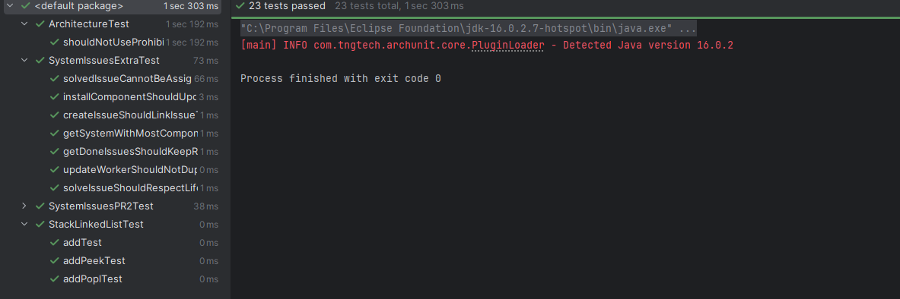

# PR2 - System Issues Management

## Author
- name: Abraham Barrera
- e-mail: abarrerah@uoc.edu

## Scope of the submission
This submission includes the implementation of the PR2 project for the `SystemIssues` ADT.

The project covers:
- The implementation of `SystemIssuesPR2Impl`
- The implementation of the model classes:
    - `Worker`
    - `System`
    - `Component`
    - `Issue`
- The implementation of the custom exceptions defined in the interface
- The implementation of the auxiliary data structures required by the project
- Validation through the provided test suite
- Additional test cases created to extend the original test coverage

## Overview
This project implements a computer system issue management system that supports the administration of workers, systems, components, and issues.

The application allows:
- registering and updating workers, systems, and components
- installing components into systems
- creating issues linked to components
- assigning issues to workers using a LIFO strategy
- solving assigned issues
- querying the registered systems and relationships between entities
- retrieving the top worker and the system with the highest number of components

## Main Project Components

### 1. ADT Contract: `SystemIssues.java`
This interface defines the required operations of the issue management system, including:
- `addWorker(workerId, name, address)`
- `addSystem(systemId, description, location)`
- `addComponent(componentId, trademark, model, serial)`
- `installComponentToSystem(componentId, systemId)`
- `createIssue(issueId, componentId, description, dateTime)`
- `assignIssue(issueId, workerId)`
- `solveIssue(workerId)`
- `getSystems()`
- `getComponentsBySystem(systemId)`
- `getDoneIssuesByWorker(workerId)`
- `getTopWorker()`
- `getSystemWithMostComponents()`

It also includes helper access through `getSystemIssuesHelper()`.

### 2. Implementation: `SystemIssuesPR2Impl.java`
This class implements the `SystemIssues` interface and contains the core business logic of the project.

Its main responsibilities are:
- storing all workers, systems, components, and issues
- managing the relationships between entities
- applying the LIFO rule for assigned issues
- maintaining the information required by the helper interface
- validating preconditions and throwing the proper exceptions

### 3. Helper Interface: `SystemIssuesHelper.java`
This interface provides support methods for internal inspection and validation:
- `getWorker(String id)`
- `numWorkers()`
- `getSystem(String id)`
- `numSystems()`
- `getComponent(String id)`
- `numComponents()`
- `numComponentsBySystem(String systemId)`
- `numIssues()`
- `numIssuesByComponent(String componentId)`
- `numIssuesByWorker(String workerId)`

### 4. Data Models
The following model classes are part of the implementation:
- `Worker.java`
- `System.java`
- `Component.java`
- `Issue.java`

### 5. Custom Exceptions
The following exceptions are implemented:
- `DSException`
- `ComponentNotFoundException`
- `ComponentAlreadyInstalledException`
- `IssueNotFoundException`
- `IssueAlreadyAssignedException`
- `IssueAlreadyResolvedException`
- `WorkerNotFoundException`
- `NoIssuesException`
- `NoWorkerException`
- `NoSystemsException`
- `SystemHasNoComponentsException`

## Modifications and/or updates over the initial PEC1 design
Compared with the initial PEC1 proposal, the implementation was adapted to satisfy the constraints and expectations of the PR2 test suite.

### Design decisions
- The solution avoids prohibited `java.util` data structures.
- The assigned issues of each worker are managed using a LIFO structure.
- Systems keep track of their installed components.
- Components keep track of their related issues.
- Workers keep track of both assigned and completed issues.

### Justification
These decisions were necessary to:
- match the functional contract of the `SystemIssues` interface
- comply with the architectural constraints of the project
- support the behavior validated by the official tests
- keep the implementation consistent with the data structures studied in the course

## Provided test classes
The project includes the following provided tests:
- `ArchitectureTest.java`
- `SystemIssuesPR2Test.java`
- `FactorySystemIssues.java`
- `StackLinkedListTest.java`

These tests validate:
- entity creation and updates
- issue creation, assignment, and resolution
- LIFO behavior
- queries over systems, components, and completed issues
- architectural restrictions on forbidden Java collections

## Additional test cases
As requested in the PR2 statement, the test suite was extended with additional cases.

### Added tests
Include here the additional test files you created, for example:
- `SystemIssuesExtraTest.java`
- `StackLinkedListExtraTest.java`

### Purpose of the new tests
The new tests were added to validate extra scenarios such as:
- consistency of links between related entities
- additional LIFO checks
- update operations without duplication
- edge cases not explicitly covered by the provided test suite

## Problems encountered and additional comments
During the implementation, the main challenge was designing the solution while respecting the restriction of not modifying the provided test files and not relying on forbidden `java.util` collection classes.

Another important point was keeping the implementation aligned with both:
- the functional specification inherited from PEC1
- the behavior required by the PR2 tests

## How to run the project
1. Import the Maven project into the IDE.
2. Verify that the project SDK is correctly configured.
3. Make sure the DSLib JAR is available in the expected location.
4. Run all JUnit tests from `src/test/java`.

## Final remarks
This submission follows the structure of the provided base project and implements the required functionality for the `SystemIssues` ADT.

The solution is designed to be compatible with the official tests and with the additional tests included in the submission.

## Evidence of test execution

All JUnit tests in `src/test/java` were executed successfully in green.

